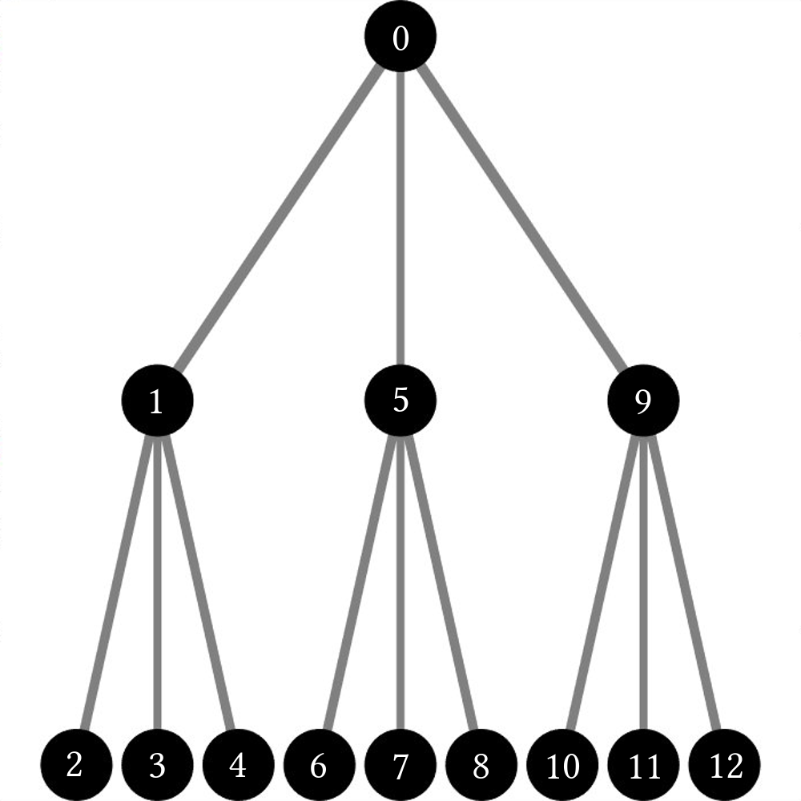
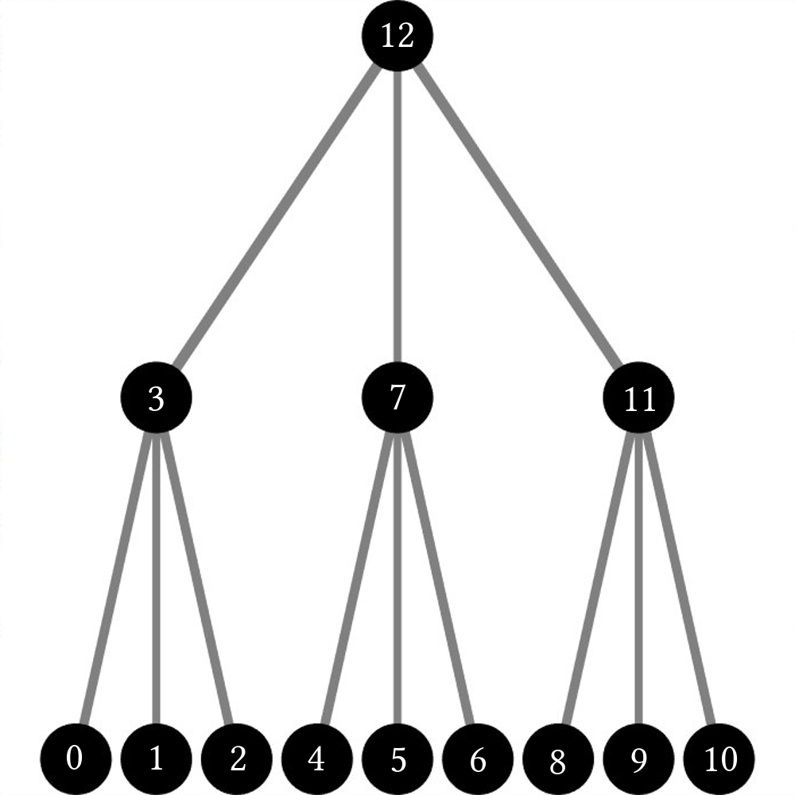
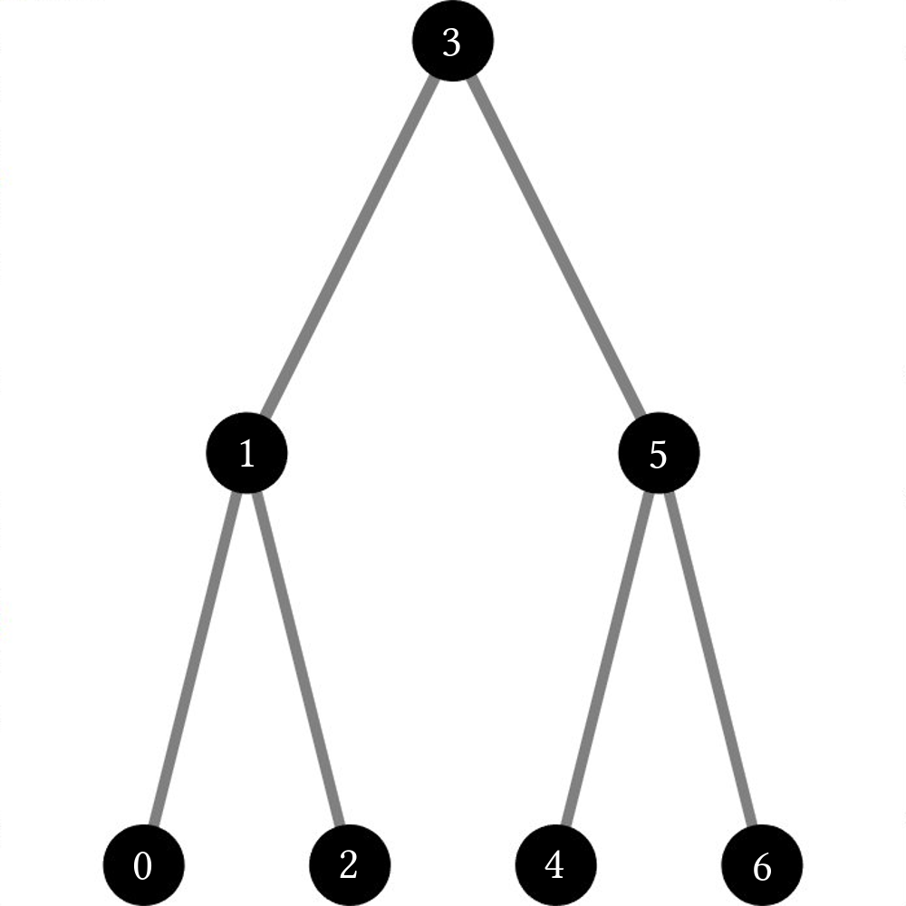
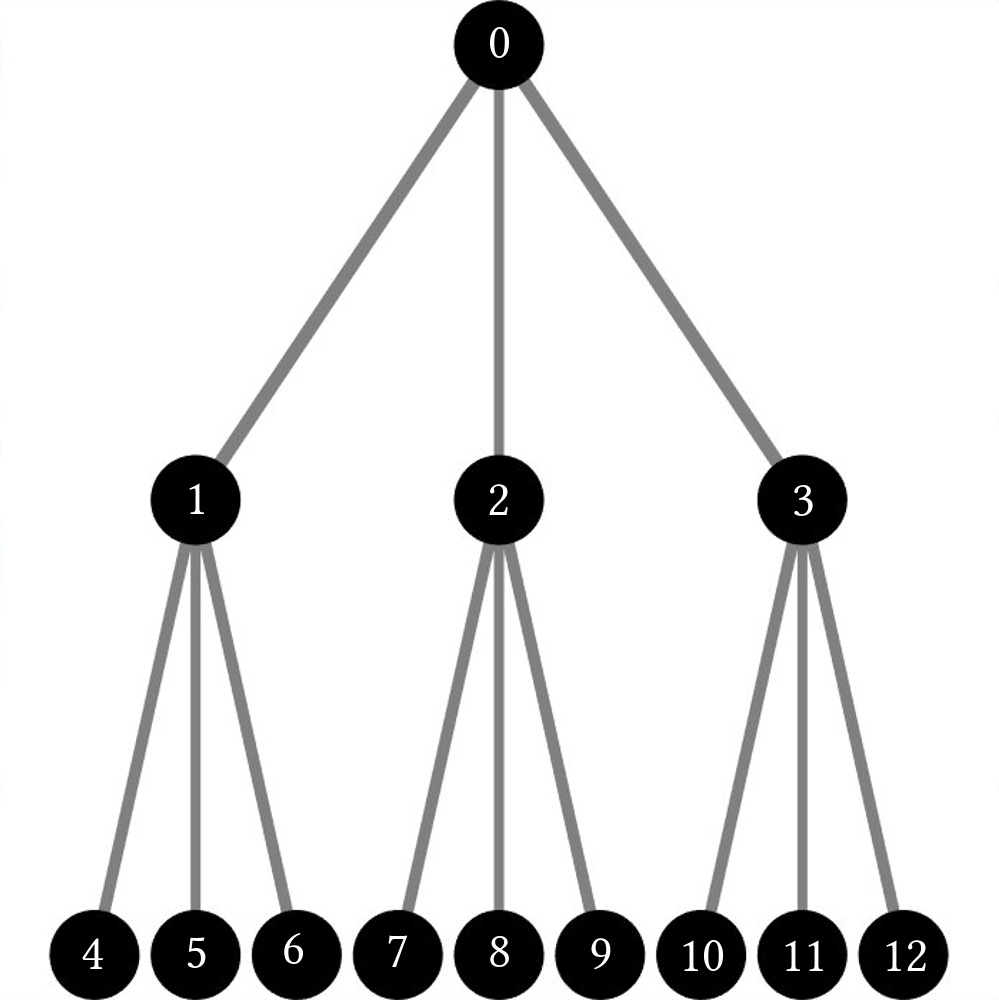
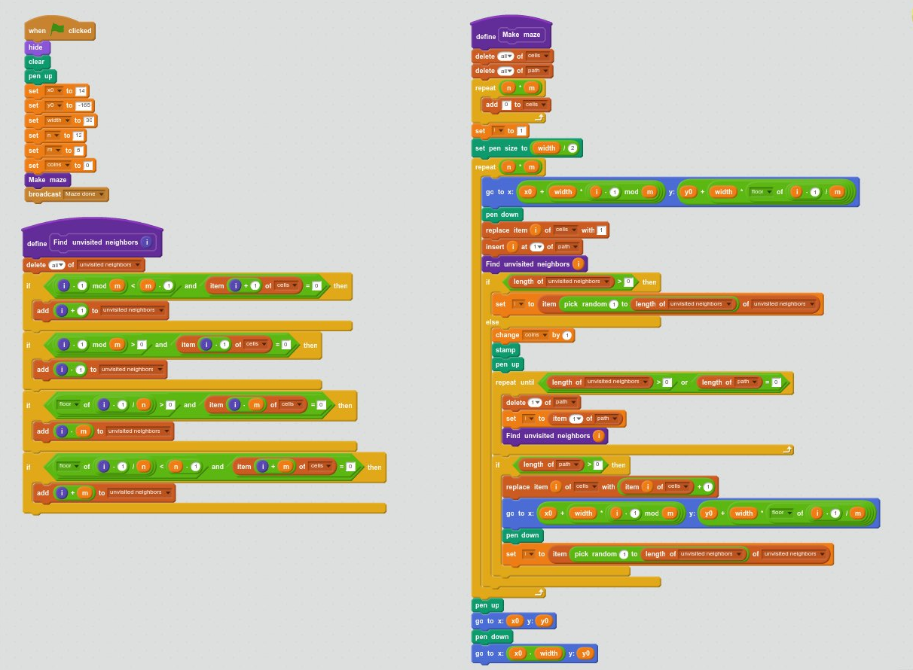

<script>
MathJax.Hub.Queue(["Typeset",MathJax.Hub]);
</script>
$$ 
\newcommand{\d}{\mathrm{d}}
\newcommand{\bff}{\boldsymbol{f}}
\newcommand{\bfg}{\boldsymbol{g}}
\newcommand{\bfp}{\boldsymbol{p}}
\newcommand{\bfq}{\boldsymbol{q}}
\newcommand{\bfx}{\boldsymbol{x}}
\newcommand{\bfu}{\boldsymbol{u}}
\newcommand{\bfv}{\boldsymbol{v}}
\newcommand{\bfA}{\boldsymbol{A}}
\newcommand{\bfB}{\boldsymbol{B}}
\newcommand{\bfC}{\boldsymbol{C}}
\newcommand{\bfM}{\boldsymbol{M}}
\newcommand{\bfJ}{\boldsymbol{J}}
\newcommand{\bfR}{\boldsymbol{R}}
\newcommand{\bfT}{\boldsymbol{T}}
\newcommand{\bfomega}{\boldsymbol{\omega}}
\newcommand{\bftau}{\boldsymbol{\tau}}
$$

# Tree Traversal 

Trees are naturally recursive data structures, and because of this, we cannot access their elements like we might access the elements of a vector or array. Instead, we need to use more interesting methods to work through each element. This is often called *Tree Traversal*, and there are many different ways to do this. For now, we will restrict the discussion to two common and related methods of tree traversal: *Depth-First* and *Breadth-First Search*. Note that trees vary greatly in shape and size depending on how they are used; however, they are composed primarily of nodes that house other, children nodes, like so:

```cpp
struct node{
    std::vector<node> children;
    int ID;
};
```

Because of this, the most straightforward way to traverse the tree might be recursive. This naturally leads us to the Depth-First Search (DFS) method:

```cpp
void DFS_recursive(const node& n){

    // Here we are doing something...
    std::cout << n.ID << '\n';

    for (int i = 0; i < n.children.size(); ++i){
        DFS_recursive(n.children[i]);
    }
}

```

At least to me, this makes a lot of sense. We fight recursion with recursion! First, we first output the node we are on and then we call `DFS_recursive(...)` on each of its children nodes. This method of tree traversal does what its name implies: it goes to the depths of the tree first before going through the rest of the branches. In this case, the ordering looks like:



Note that the in the code above, we are missing a crucial step: *checking to see if the node we are using actually exists!* Because we are using a vector to store all the nodes, we will be careful not to run into a case where we call `DFS_recursive(...)` on a node that has yet to be initialized; however, depending on the language we are using, we might need to be careful of this to avoid recursion errors! 

Now, in this case the first element searched through is still the root of the tree. This type of tree traversal is known as *pre-order* DFS. We perform an action (output the ID) *before* searching through the children. If we shift the function around and place the data output at the end of the function, we can modify the order in which we search through the tree to be *post-order* and look something like this:


```cpp
void DFS_recursive_postorder(const node& n){

    for (int i = 0; i < n.children.size(); ++i){
        DFS_recursive(n.children[i]);
    }

    // Here we are doing something...
    std::cout << n.ID << '\n';
}

```



In this case, the first node visited is at the bottom of the tree and moves up the tree branch by branch. In addition to these two types, binary trees have an *in-order* traversal scheme that looks something like this:


```cpp

// This assumes only 2 children
void DFS_recursive_inorder(const node& n){

    if (n.children.size() > 2){
        std::cout << "Not binary tree!" << '\n';
        exit(1);
    }

    if (n.children.size() > 0){
        DFS_recursive_btree(n.children[0]);
        std::cout << n.ID << '\n';
        DFS_recursive_btree(n.children[1]);
    }
    else{
        std::cout << n.ID << '\n';
    }

}

```



The order here seems to be some mix of the other 2 methods and works through the binary tree from left to right.

Now, at this point, it might seem that the only way to search through a recursive data structure is with recusion, but this is not necessarily the case! Rather surprisingly, we can perform a DFS non-recursively by using a stack, which are data structures that hold multiple elements, but only allow you to interact with the very last element you put in. The idea here is simple:

1. Put the root node in the stack
2. Take it out and put in its children
3. Pop the top of the stack and put its children in
4. Repeat 3 until the stack is empty

In code, it looks like this:

```cpp
void DFS_stack(const node& n){
    std::stack<node> s;
    s.push(n);
    node temp;

    while(s.size() > 0){
        std::cout << s.top().ID << '\n';
        temp = s.top();
        s.pop();
        for (int i = 0; i < temp.children.size(); ++i){
            s.push(temp.children[i]);
        }
    }
}
```

All this said, there are a few details about DFS that might not be idea, depending on the situation. For example, if we use DFS on an incredibly long tree, we will spend a lot of time going further and further down a single branch without searching the rest of the data structure. In addition, it is not the natural way humans would order a tree if asked to number all the nodes from top to bottom. I would argue a more natural traversal order would look something like this:



And this is exactly what Breadth-First Search (BFS) does! On top of that, it can be implemented in the same way as the `DFS_stack(...)` function above, simply by swapping the `stack` for a `queue`, which is similar to a stack, exept that it only allows you to interact with the very first element instead of the last. In code, this looks something like:

```cpp
void BFS_queue(const node& n){
    std::queue<node> q;
    q.push(n);
    node temp;

    while(q.size() > 0){
        std::cout << q.front().ID << '\n';
        temp = q.front();
        q.pop();
        for (int i = 0; i < temp.children.size(); ++i){
            q.push(temp.children[i]);
        }
    }
}

```

# Point of Discussion
I have used C++ syntax for this chapter; however, this goes against my policy to keep the Algorithm Archive language-indifferent. On the one had, it's nice to see compilable code in the archive. On the other had, I don't want this to become a C++ book. I think I will try to come up with a clear psudocode scheme and use it throughout this book from now on, but I wanted to hear your thoughts.

Do you think we should be using real code snippets in the main text or stick them at the end?

# Example Code

### C++:

```cpp
// initially contributed by James Schloss (Leios)
// restyled by Nicole Mazzuca (ubsan)

#include <iostream>
#include <cstddef>
#include <utility>
#include <vector>
#include <stack>
#include <queue>

using std::size_t;

class Tree {
    std::vector<Tree> children;
    int value;
public:
    Tree(int value): children(), value(value) {}

    void add_child(Tree child)
    {
        children.push_back(std::move(child));
    }

    // Simple recursive scheme for DFS
    void DFS_recursive() const {
        // Here we are doing something...
        std::cout << value << '\n';
        for (Tree const& child: children) {
            child.DFS_recursive();
        }
    }

    // Simple non-recursive scheme for DFS
    void DFS_stack() const {
        std::stack<const Tree*> stack;
        stack.push(this);

        while (stack.size() > 0) {
            const Tree& temp = *stack.top();
            stack.pop();

            std::cout << temp.value << '\n';
            for (Tree const& child: temp.children) {
                stack.push(&child);
            }
        }
    }

    // simple non-recursive scheme for BFS
    void BFS_queue() const {
        std::queue<const Tree*> queue;
        queue.push(this);

        while (queue.size() > 0) {
            const Tree& temp = *queue.front();
            queue.pop();

            std::cout << temp.value << '\n';
            for (Tree const& child: temp.children) {
                queue.push(&child);
            }
        }
    }
};

Tree create_tree(size_t num_row, size_t num_child)
{
    // We'll just set the ID to whatever we want here...
    Tree ret(num_row);

    if (num_row == 0) {
        return ret;
    }

    // Creating children
    for (size_t i = 0; i < num_child; ++i) {
        Tree child = create_tree(num_row - 1, num_child);
        ret.add_child(std::move(child));
    }

    return ret;
}


int main() {
    // Creating Tree in main
    Tree root = create_tree(3, 3);
    root.DFS_recursive();
    root.DFS_stack();
    root.BFS_queue();
}
```

### Python 2:

```python

# /*-------------simple_tree_traversal.py--------------------------------------//
# *
# * Purpose: To implement basic tree traversal in Python.
# *
# * Run: python simple_tree_traversal.py
# *
# *-----------------------------------------------------------------------------*/


class Node:

    def __init__(self):
        self.data = None
        self.children = []


def create_tree(node, num_row, num_child):
    node.data = num_row

    if num_row > 0:
        for i in range(num_child):
            child = create_tree(Node(), num_row-1, num_child)
            node.children.append(child)

    return node

def DFS_recursive(node):
    if len(node.children) > 0:
        print node.data

        for child in node.children:
            DFS_recursive(child)

def DFS_stack(node):
    stack = []
    stack.append(node)

    temp = None

    while len(stack) > 0:
        print stack[-1].data
        temp = stack.pop()

        for child in temp.children:
            stack.append(child)

def BFS_queue(node):
    queue = []
    queue.append(node)

    temp = None

    while len(queue) > 0:
        print queue[0].data
        temp = queue.pop(0)

        for child in temp.children:
            queue.append(child)

def main():
    tree = create_tree(Node(), 3, 3)

    print "Recursive:"
    DFS_recursive(tree)

    print "Stack:"
    DFS_stack(tree)

    print "Queue:"
    BFS_queue(tree)

main()
```

### Python 3
```python
# Depth-First and Breadth-First Traversal
# Submitted by Matthew Giallourakis 
from collections import deque
 
class node():
    "Create the node structure"
    def __init__(self, value, left, right):
        self.value = value
        self.left = left
        self.right = right
 
def make_tree(root,nums):
    "Makes a binary search tree from a list of numbers"
    for num in nums:
        temp_node = root
        new_node = node(value=num, left=None, right=None)
        while True:
            if num < temp_node.value:
                if temp_node.left is None:
                    temp_node.left = new_node
                    break
                else:
                    temp_node = temp_node.left
            elif num > temp_node.value:
                if temp_node.right is None:
                    temp_node.right = new_node
                    break
                else:
                    temp_node = temp_node.right
 
def depth_first_search(root):
    "Traverses through a tree depth-first by putting nodes on a stack"
    stack = deque()
    result_list = []
    stack.append(root)
    while len(stack) != 0:
        # Take off the node at the top of the stack, add it to the list
        temp_node = stack.pop()
        result_list.append(temp_node.value)
        # Add the children of that node to the top of the stack
        if temp_node.right is not None:
            stack.append(temp_node.right)
        if temp_node.left is not None:
            stack.append(temp_node.left)
    return result_list
 
 
def breadth_first_search(root):
    "Traverses through a tree breadth-first by putting nodes into a queue"
    queue = deque()
    result_list = []
    queue.append(root)
    while len(queue) != 0:
        # Take off the node at the top of the queue, add it to the list
        temp_node = queue.pop()
        result_list.append(temp_node.value)
        # Add the children of that node to the bottom of the queue
        if temp_node.left is not None:
            queue.appendleft(temp_node.left)
        if temp_node.right is not None:
            queue.appendleft(temp_node.right)
    return result_list
 
 
def main():
    nums = [5,8,6,9,2,1,3]
    root = node(value=nums.pop(0),left=None,right=None)
    make_tree(root,nums)
    #     Tree Structure
    #           5
    #       2       8
    #     1   3   6   9
    #              
 
    print("Depth First:",depth_first_search(root))
    # prints [5, 2, 1, 3, 8, 6, 9]
     
    print("Breadth First:",breadth_first_search(root))
    # prints [5, 2, 8, 1, 3, 6, 9]
     
 
if __name__ == '__main__':
    main()
 
```

### C

```c
// Submitted by Gathros
#include <stdio.h>
#include <stdlib.h>
#include <string.h>

typedef struct node{
    struct node *children; // I chose a pointer to create a dynamic array
    int children_num;
    int ID;
} node;

// There is no stack or queue in c so I created my own
typedef struct node_list{
    node n;
    struct node_list *last_list, *next_list;
} node_list;

typedef struct node_points{
    node_list *start_point, *end_point;
} node_points;

void push(node_points *np, node *n){
    // Adding node into a queue or a stack
    node_list *temp = (node_list*)malloc(sizeof(node_list));
    temp->n = *n;
    temp->last_list = temp->next_list = NULL;
    
    if(!np->end_point){
	np->start_point = temp;
    }else{
	np->end_point->next_list = temp;
	temp->last_list = np->end_point;
    }
    np->end_point = temp;
}

void stack_pop(node_points *np){
    // Removing the last node_list of the stack
    node_list *temp;
    temp = np->end_point;
    if(temp){
	np->end_point = temp->last_list;
	if(!np->end_point){
	    np->start_point = NULL;
	}
	free(temp);
    }
}

void queue_pop(node_points *np){
    // Removing the first node_list of the queue
    node_list *temp;
    temp = np->start_point;
    if(temp){
	np->start_point = temp->next_list;
	if(!np->start_point){
	    np->end_point = NULL;
	}
	free(temp);
    }
}

void create_tree(node *n, int num_row, int num_child) {
    n->ID = num_row;
    if(num_row == 0){
	return;
    }

    // Creating children
    // Using malloc to make an array of nodes with size num_child
    n->children = (node *)malloc(num_child*sizeof(*n->children));
    // When an array is made into a pointer you can't get it's size later
    n->children_num = num_child;
    for(int i = 0; i < num_child; ++i){
        node child;
        create_tree(&child, num_row - 1, num_child);
        *(n->children + i) = child;
    }
}

void DFS_recursive(node *n){
    printf("%d\n", n->ID);
    
    // Checking if the node's children exist
    if(!n->children){
        return;
    }
    
    for(int i = 0; i < n->children_num; ++i){
        DFS_recursive((n->children + i));
    }
}

void DFS_stack(node *n){
    // Creating a stack and then setting its value to 0
    node_points stack;
    memset(&stack, 0, sizeof(node_points));
    push(&stack, n);
    node temp;

    while(stack.start_point != NULL){
	temp = stack.end_point->n;
	printf("%d\n", temp.ID);
	stack_pop(&stack);
	for(int i=0; i < temp.children_num; ++i){
	    // Checking if the node has any children
	    if(!temp.children){
		break;
	    }
	    push(&stack, temp.children + i);
	}
    }
}

void BFS_queue(node *n){
    // Creating a queue and then setting its value to 0
    node_points queue;
    memset(&queue, 0, sizeof(node_points));
    push(&queue, n);
    node temp;

    while(queue.start_point != NULL){
	temp = queue.start_point->n;
	printf("%d\n", temp.ID);
	queue_pop(&queue);
	for(int i = 0; i < temp.children_num; ++i){
	    // Checking if the node has any children
	    if(!temp.children){
		break;
	    }
	    push(&queue, temp.children + i);
	}
    }
}

void destroy_tree(node *n){
    // This function is for cleaning up all the nodes
    if(n->ID == 0){
	return;
    }
    
    for(int i = 0; i < n->children_num; ++i){
	destroy_tree(n->children + i);
    }
    free(n->children);
}

int main() {
    node root;
    create_tree(&root, 3, 3);
    //DFS_recursive(&root);
    //DFS_stack(&root);
    BFS_queue(&root);
    destroy_tree(&root);
    
    return 0;
}
```

### C#:

```cs
// submitted by Julian Schacher‏
using System;
using System.Collections.Generic;

namespace Tree_Traversal
{
    class Program
    {
        static void Main(string[] args)
        {
            var root = TreeCreator.CreateTree(3, 3);
            Console.WriteLine("DFSRecursive:");
            Algorithms.DFSRecursive(root);
            Console.WriteLine("DFSStack:");
            Algorithms.DFSStack(root);
            Console.WriteLine("DFSQueue");
            Algorithms.BFSQueue(root);
        }
    }

    public static class TreeCreator
    {
        public static Node CreateTree(int depthCount, int childrenCount)
        {
            var root = new Node
            {
                Id = 1
            };
            CreateAllChildren(root, depthCount, childrenCount);
            return root;
        }

        private static void CreateAllChildren(Node node, int rowCount, int childrenCount)
        {
            if (rowCount <= 1)
                return;

            for (int i = 0; i < childrenCount; i++)
            {
                node.Children.Add(new Node
                {
                    Id = node.Id * 10 + i + 1
                });
                CreateAllChildren(node.Children[i], rowCount - 1, childrenCount);
            }
        }
    }

    public static class Algorithms
    {
        public static void DFSRecursive(Node node)
        {
            Console.WriteLine(node.Id);

            foreach (var c in node.Children)
            {
                DFSRecursive(c);
            }
        }

        public static void DFSStack(Node node)
        {
            var stack = new Stack<Node>();
            stack.Push(node);
            Node temp;

            while (stack.Count != 0)
            {
                Console.WriteLine(stack.Peek().Id);
                temp = stack.Pop();

                foreach (var c in temp.Children)
                {
                    stack.Push(c);
                }
            }
        }

        public static void BFSQueue(Node node)
        {
            var queue = new Queue<Node>();
            queue.Enqueue(node);
            Node temp;

            while (queue.Count != 0)
            {
                Console.WriteLine(queue.Peek().Id);
                temp = queue.Dequeue();

                foreach (var c in temp.Children)
                {
                    queue.Enqueue(c);
                }
            }
        }
    }

    public class Node
    {
        public List<Node> Children { get; set; } = new List<Node>();
        public int Id { get; set; }
    }
}
```

### JavaScript

```html
<!DOCTYPE html>
<html>
<body>
<script>
function create_tree(n, num_row, num_child){
	n.ID = num_row;
    n.children = [];
	if(num_row == 0){
		return;
	}

	for(var i = 0; i < num_child; ++i){
		var child = new Object();
		create_tree(child, num_row - 1, num_child);
		n.children.push(child);
	}
};

function DFS_recursive(n){
	document.write(n.ID + "<br>");
    if(n.children.length == 0){
    	return;
    }
	for(var i = 0; i < n.children.length; ++i){
		DFS_recursive(n.children[i]);
	}
}

function DFS_stack(n){
	var s = [];
    s.push(n);
    var temp;
    
    while(s.length > 0){
    	temp = s.pop();
    	document.write(temp.ID + "<br>");
        for(var i = 0; i < temp.children.length; ++i){
        	if(temp.children.length == 0){
            	break;
            }
        	s.push(temp.children[i]);
        }
    }
}

function BFS_queue(n){
	var q = [];
    q.push(n);
    var temp;
    
    while(q.length > 0){
    	temp = q.shift();
    	document.write(temp.ID + "<br>");
        for(var i = 0; i < temp.children.length; ++i){
        	if(temp.children.length == 0){
            	break;
            }
        	q.push(temp.children[i]);
        }
    }
}

var root = new Object();
create_tree(root, 3, 3);
//DFS_recursive(root);
//DFS_stack(root);
BFS_queue(root);
</script>
</body>
<html>
```

### Haskell
```hs
--- Submitted by Jie
data Tree a = Empty
            | Node {node :: a,
                    forest :: [Tree a]}
                       deriving (Show)

dfs :: Tree a -> [a]
dfs Empty = []
dfs (Node x ts) = x : concatMap dfs ts

bfs :: Tree a -> [a]
bfs Empty = []
bfs (Node x ts) = x : go ts
  where go [] = []
        go ts = map node ts ++ go (concatMap forest ts)

main = do
  print $ dfs testTree
  print $ bfs testTree

testTree :: Tree Int
testTree = Node 1 [Node 2 [Node 3 [],
                           Node 4 [ Node 5 []]],
                   Node 6 [Node 7 [],
                           Node 8 [ Node 9 [Node 10 [Node 11 []],
                                            Node 12 []]],
                           Node 13 [Node 14 []]],
                   Node 15 []]

```

### OCaml
```ocaml
(* submitted by Nicole Mazzuca (ubsan) *)
module Tree: sig
  (*
    create a module signature
    this allows us to not give out any implementation details
  *)
  type t

  val create: int -> t
  val add_child: t -> t -> t
  val dfs_recursive: t -> unit
  val dfs_stack: t -> unit
  val bfs_queue: t -> unit
end =
struct
  type t = { children: t list; value: int }

  let create value = { children = []; value = value }
  (*
    note: doing it this way means that we create lots of lists
    it could mean, potentially, a lot of allocations
    however, it also means we're functionally pure, which is nice
  *)
  let add_child self child = 
    { children = child :: self.children; value = self.value }

  (* recursive is by far the easiest to do in functional langs *)
  let rec dfs_recursive self =
    print_int self.value |> print_newline;
    List.iter dfs_recursive self.children

  (*
    both dfs_stack and bfs_queue are almost identical to C++
    there's not much interesting here
  *)
  let dfs_stack self =
    (* let open is :+1: *)
    let open Stack in
    let stack = create () in
    push self stack;
    while (not (is_empty stack)) do
      let temp = pop stack in
      print_int temp.value |> print_newline;
      List.iter
        (function child -> push child stack)
        temp.children
    done

  let bfs_queue self =
    let open Queue in
    let queue = create () in
    add self queue;
    while (not (is_empty queue)) do
      let temp = take queue in
      print_int temp.value |> print_newline;
      List.iter
        (function child -> push child queue)
        temp.children
    done
end

let rec create_tree num_row num_child =
  let open Tree in
  let tree = create num_row in
  match num_row with
  | 0 -> tree
  | n ->
      let child = create_tree (num_row - 1) num_child in
      (*
        using a recursive function, instead of a for loop,
        allows us to not use mutation

        this is basically a for loop, written with recursive
        functions :)
      *)
      let rec inner tree = function
      | 0 -> tree
      | n -> add_child (inner tree (n - 1)) child
      in (inner tree num_child)

let main () =
  let tree = create_tree 3 3 in
  print_string "--- dfs_recursive --- \n";
  Tree.dfs_recursive tree;
  print_string "--- dfs_stack --- \n";
  Tree.dfs_stack tree;
  print_string "--- bfs_queue --- \n";
  Tree.bfs_queue tree

let () = main ()
```

### Rust
```rust
// Submitted by Gustorn
use std::collections::VecDeque;

struct Tree {
    value: i32,
    children: Vec<Tree>,
}

impl Tree {
    fn new(depth: i32, num_children: usize) -> Tree {
        let mut tree = Tree { value: depth, children: vec![] };
        if depth > 0 {
            for _ in 0..num_children {
                tree.children.push(Tree::new(depth - 1, num_children));
            }
        }
        tree
    }
    
    fn dfs_recursive(&self) {
        println!("{}", self.value);
        for child in &self.children {
            child.dfs_recursive();
        }
    }
    
    fn dfs_stack(&self) {
        let mut stack = vec![self];
        while let Some(top) = stack.pop() {
            println!("{}", top.value);
            stack.extend(&top.children);
        }
    }
    
    fn bfs_queue(&self) {
        let mut queue = VecDeque::new();
        queue.push_back(self);
        while let Some(first) = queue.pop_front() {
            println!("{}", first.value);
            queue.extend(&first.children);
        }
    }
}

fn main() {
    let tree = Tree::new(3, 3);
    tree.dfs_recursive();
    tree.dfs_stack();
    tree.bfs_queue();
}
```

### Scratch
Submitted by Jie

[https://scratch.mit.edu/projects/174017753/](https://scratch.mit.edu/projects/174017753/)


